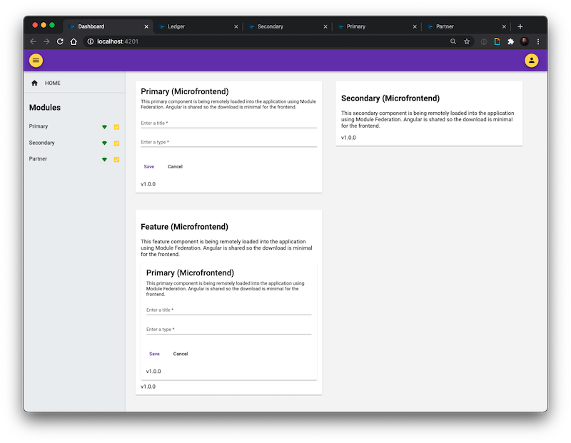
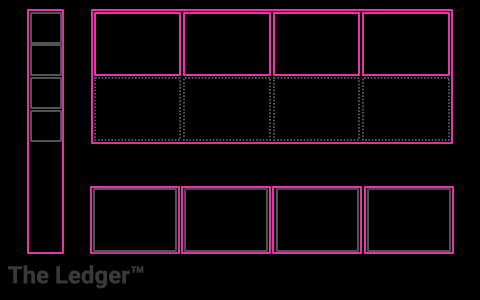
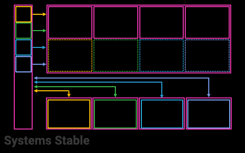
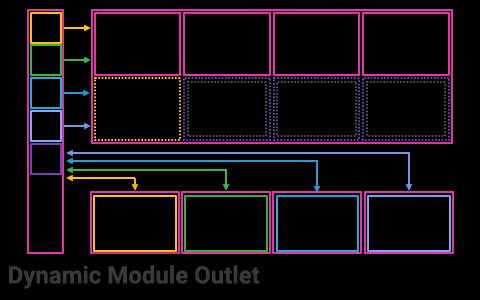

# Federated Modules Example

This is an example demonstrating how we can use federated modules to solve enterprise-level problems.

## Prerequisites

- [Git](https://git-scm.com/book/en/v2/Getting-Started-Installing-Git)
- Node.js and NPM – we recommend using [NVM (Linux/Mac)](https://github.com/creationix/nvm) or [NVM-Windows (Windows)](https://github.com/coreybutler/nvm-windows)
- Install Angular CLI via `npm i -g @angular/cli`

## Getting Started

Because this is a demonstration of how to consume N number of hosted applications into a single application, we will be spinning a couple of stand alone applications at once. 

```bash
git clone https://github.com/briebug/ng-module-republic.git
cd ng-module-republic
yarn
yarn serve:all
```

And run each of these commands in their own tab.

```bash
yarn serve:primary
yarn serve:secondary
yarn serve:partner
```

The `serve:all` command is a convenience methods that runs the `serve:api`, `serve:ledger` and `serve:dashboard` commands concurrently. You can run each command separately if you need to.

```json
"serve:api": "nx run api:serve",
"serve:ledger": "nx run ledger:serve --port=4200 --open",
"serve:dashboard": "nx run dashboard:serve --port=4201 --open",
"serve:primary": "nx run primary:serve --port=4202 --open",
"serve:secondary": "nx run secondary:serve --port=4203 --open",
"serve:partner": "nx run partner:serve --port=4204 --open",
"serve:remotes": "concurrently \"npm run serve:primary\" \"npm run serve:secondary\" \"npm run serve:partner\"",
"serve:all": "concurrently \"npm run serve:api\" \"npm run serve:ledger\" \"npm run serve:dashboard\"",
```

The `ledger` application will open to [http://localhost:4200](http://localhost:4200) in your browser.

The `dashboard` application will open to [http://localhost:4201](http://localhost:4201) in your browser.

The `primary` application will open to [http://localhost:4202](http://localhost:4202) in your browser.

The `secondary` application will open to [http://localhost:4203](http://localhost:4203) in your browser.

The `partner` application will open to [http://localhost:4204](http://localhost:4204) in your browser.

> Note: the above terminal commands are for Mac. Remember to substitute the appropriate commands for your OS.

## Applied Concepts

This application demonstrates a few interesting ideas of how an organization can apply federated modules to their enterprise applications.

### Module Discovery



Imagine we have a dashboard that would like to consume any number of modules if it only knew what was available. By introducing a "ledger," modules can register themselves as available for consumption. Consumers can then query the ledger to discover what modules are available and then consume them. The ledger allows for additional modules to be added and then consumed in realtime.

### Module Health



Now that we know how to discover modules, how do we verify that they are healthy and available? The ledger can monitor registered modules, and if a module goes offline, it will detect this change and mark the module as unhealthy. Once the module is marked unhealthy, it will broadcast to the connected consumers that a module is offline so they can respond accordingly.

### Module Inception



We can do some exciting things but using federated modules to load federated modules. This arrangement presents some pretty compelling use cases that involve dynamic feature composition and consumption from independent development sources. For instance, you could create a top-level module outlet for 3rd party vendors that your users can then dynamically load in modules from an ecosystem or marketplace at their discretion.
